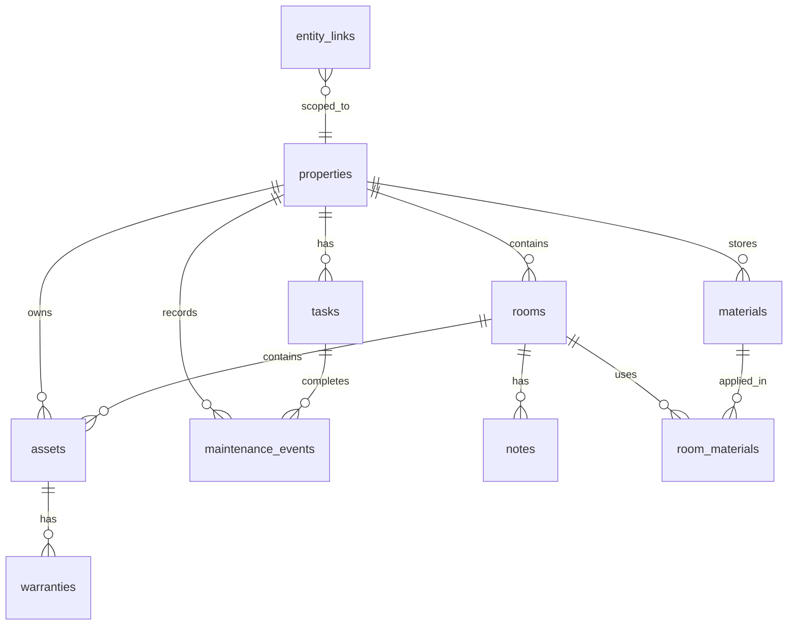

# Koti — Data Model

Refined schema for the MVP. Uses **direct foreign keys** for core relationships and an **`entity_links`** table for flexible many-to-many cross-referencing.

## Entity Relationship Overview



## Core Tables

### users (Phase 2 — stub for MVP)

| Column | Type | Notes |
|---|---|---|
| id | TEXT PK | UUID |
| email | TEXT | Unique |
| name | TEXT | |
| created_at | INTEGER | Unix timestamp |

MVP uses a single default user without auth.

---

### properties

Root entity for a home or rental.

| Column | Type | Notes |
|---|---|---|
| id | TEXT PK | UUID |
| name | TEXT | e.g. "Main Home", "Cabin" |
| address | TEXT | Full address |
| property_type | TEXT | house, apartment, townhouse, duplex, other |
| year_built | INTEGER | Nullable |
| size_sqm | REAL | Nullable |
| notes | TEXT | Shutoff locations, panel info |
| created_at | INTEGER | |
| updated_at | INTEGER | |

---

### rooms

Each room is a "room passport."

| Column | Type | Notes |
|---|---|---|
| id | TEXT PK | UUID |
| property_id | TEXT FK → properties | |
| name | TEXT | Living Room, Kitchen, etc. |
| floor | TEXT | Ground, 1st, Basement |
| notes | TEXT | Freeform |
| created_at | INTEGER | |
| updated_at | INTEGER | |

---

### materials

Central library for paints, flooring, filters, etc.

| Column | Type | Notes |
|---|---|---|
| id | TEXT PK | UUID |
| property_id | TEXT FK → properties | |
| name | TEXT | Display name |
| category | TEXT | paint, flooring, tile, filter, hardware, other |
| brand | TEXT | Nullable |
| color_code | TEXT | Nullable |
| sku | TEXT | Nullable |
| finish | TEXT | matte, satin, gloss, etc. |
| supplier | TEXT | Nullable |
| leftover_location | TEXT | e.g. "Garage shelf B" |
| notes | TEXT | |
| created_at | INTEGER | |
| updated_at | INTEGER | |

---

### room_materials

Many-to-many: which materials are used in which rooms/surfaces.

| Column | Type | Notes |
|---|---|---|
| id | TEXT PK | UUID |
| room_id | TEXT FK → rooms | |
| material_id | TEXT FK → materials | |
| surface | TEXT | walls, ceiling, trim, floor |
| notes | TEXT | |
| applied_at | INTEGER | Nullable date |

---

### assets

Fixed and movable inventory items.

| Column | Type | Notes |
|---|---|---|
| id | TEXT PK | UUID |
| property_id | TEXT FK → properties | |
| room_id | TEXT FK → rooms | Nullable if system-level |
| name | TEXT | |
| category | TEXT | appliance, fixture, furniture, system, other |
| brand | TEXT | Nullable |
| model | TEXT | Nullable |
| serial_number | TEXT | Nullable |
| purchase_date | INTEGER | Nullable |
| purchase_price | REAL | Nullable |
| replacement_value | REAL | Nullable |
| notes | TEXT | |
| created_at | INTEGER | |
| updated_at | INTEGER | |

---

### warranties

Linked to assets (and optionally materials).

| Column | Type | Notes |
|---|---|---|
| id | TEXT PK | UUID |
| asset_id | TEXT FK → assets | |
| provider | TEXT | Manufacturer, store |
| expires_at | INTEGER | |
| terms | TEXT | Nullable |
| notes | TEXT | |
| created_at | INTEGER | |

---

### tasks

One-off and recurring maintenance work.

| Column | Type | Notes |
|---|---|---|
| id | TEXT PK | UUID |
| property_id | TEXT FK → properties | |
| room_id | TEXT FK → rooms | Nullable |
| asset_id | TEXT FK → assets | Nullable |
| title | TEXT | |
| description | TEXT | Nullable |
| priority | TEXT | low, normal, urgent |
| skill_level | TEXT | diy, professional |
| recurrence | TEXT | none, daily, weekly, monthly, quarterly, yearly, custom |
| recurrence_interval_days | INTEGER | For custom recurrence |
| due_date | INTEGER | Next due date |
| estimated_cost | REAL | Nullable |
| estimated_minutes | INTEGER | Nullable |
| status | TEXT | pending, completed, skipped |
| created_at | INTEGER | |
| updated_at | INTEGER | |

---

### maintenance_events

Completed work — the property timeline.

| Column | Type | Notes |
|---|---|---|
| id | TEXT PK | UUID |
| property_id | TEXT FK → properties | |
| task_id | TEXT FK → tasks | Nullable (ad-hoc events) |
| room_id | TEXT FK → rooms | Nullable |
| asset_id | TEXT FK → assets | Nullable |
| title | TEXT | |
| description | TEXT | Nullable |
| completed_at | INTEGER | |
| cost | REAL | Nullable |
| contractor | TEXT | Nullable |
| notes | TEXT | |
| created_at | INTEGER | |

---

### notes

Freeform notes attachable to rooms (and later other entities via entity_links).

| Column | Type | Notes |
|---|---|---|
| id | TEXT PK | UUID |
| room_id | TEXT FK → rooms | |
| content | TEXT | |
| created_at | INTEGER | |
| updated_at | INTEGER | |

---

### entity_links

Flexible many-to-many cross-referencing — the knowledge graph backbone.

| Column | Type | Notes |
|---|---|---|
| id | TEXT PK | UUID |
| property_id | TEXT FK → properties | Scope all links to a property |
| source_type | TEXT | room, asset, material, task, event, note |
| source_id | TEXT | |
| target_type | TEXT | |
| target_id | TEXT | |
| relationship | TEXT | uses, has_warranty, applies_to, documents, purchased_from, leftover_at |
| created_at | INTEGER | |

**Example records:**

```
Room:Bathroom  → uses           → Material:White subway tile
Asset:Boiler   → has_warranty   → Warranty:Boiler warranty
Task:Gutters   → applies_to     → Room:Exterior
Event:Roof fix → documents      → Asset:Roof
Material:Paint → leftover_at    → Room:Garage
```

---

## Indexes

```sql
CREATE INDEX idx_rooms_property ON rooms(property_id);
CREATE INDEX idx_assets_property ON assets(property_id);
CREATE INDEX idx_assets_room ON assets(room_id);
CREATE INDEX idx_tasks_property ON tasks(property_id);
CREATE INDEX idx_tasks_due ON tasks(due_date) WHERE status = 'pending';
CREATE INDEX idx_warranties_expires ON warranties(expires_at);
CREATE INDEX idx_events_property ON maintenance_events(property_id);
CREATE INDEX idx_events_completed ON maintenance_events(completed_at);
CREATE INDEX idx_entity_links_source ON entity_links(source_type, source_id);
CREATE INDEX idx_entity_links_target ON entity_links(target_type, target_id);
CREATE INDEX idx_materials_property ON materials(property_id);
```

## Search Strategy (MVP)

Full-text search across these fields using SQLite `LIKE` (upgrade to FTS5 in Phase 2):

- properties: name, address, notes
- rooms: name, notes
- materials: name, brand, color_code, sku, notes
- assets: name, brand, model, serial_number, notes
- tasks: title, description
- maintenance_events: title, description, contractor, notes

## Recurrence Logic

When a recurring task is completed:

1. Create a `maintenance_event` from the task
2. Calculate next `due_date`:
   - `monthly` → +30 days
   - `quarterly` → +90 days
   - `yearly` → +365 days
   - `custom` → +`recurrence_interval_days`
3. Reset task status to `pending` with new due date

## Phase 2 Additions (not in MVP schema)

- `documents`, `photos`, `receipts`, `vendors`, `costs`
- `property_members` for sharing
- `areas` (floors/zones grouping rooms)
- `surfaces` as first-class entities
- `task_templates` / `task_occurrences` split
